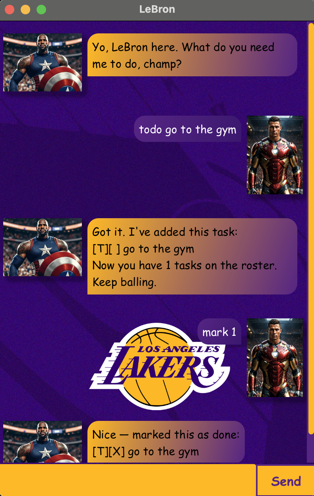

# LeBron User Guide



LeBron is your personal task management assistant with the mindset of a champion. Just like LeBron manages plays on the court, this chatbot helps you manage your daily tasks with focus and determination.

## Adding todos

Add simple tasks without any deadlines.

Example: `todo study for exam`

LeBron will add the task to your lineup:

```
Got it. I've added this task:
[T][ ] study for exam
Now you have 1 tasks on the roster. Keep balling.
```

## Adding deadlines

Add tasks that have a specific deadline you need to meet.

Example: `deadline submit assignment /by 2024-12-01`

LeBron will add the deadline to your lineup:

```
Got it. I've added this task:
[D][ ] submit assignment (by: Dec 1 2024)
Now you have 2 tasks on the roster. Keep balling.
```

## Adding events

Add events that span from a start date to an end date.

Example: `event team meeting /from 2024-11-25 /to 2024-11-25`

LeBron will add the event to your lineup:

```
Got it. I've added this task:
[E][ ] team meeting (from: Nov 25 2024 to: Nov 25 2024)
Now you have 3 tasks on the roster. Keep balling.
```

## Listing all tasks

View your complete lineup with all current tasks.

Example: `list`

LeBron shows your current lineup:

```
Here's the tasks on your roster:
1. [T][ ] study for exam
2. [D][ ] submit assignment (by: Dec 1 2024)
3. [E][ ] team meeting (from: Nov 25 2024 to: Nov 25 2024)
```

## Marking tasks as done

Mark tasks as completed when you finish them.

Example: `mark 1`

LeBron celebrates your completion:

```
Nice — marked this as done:
[T][X] study for exam
```

## Unmarking tasks

Reset a task back to not done if you need to work on it again.

Example: `unmark 1`

LeBron resets the task:

```
Got you — marked this as not done:
[T][ ] study for exam
```

## Deleting tasks

Remove tasks from your lineup when they're no longer needed.

Example: `delete 2`

LeBron clears the task from your lineup:

```
Got it. Removed these tasks:
2. [D][ ] submit assignment (by: Dec 1 2024)
Now you have 2 tasks left. Stay focused.
```

You can also delete multiple tasks at once:

Example: `delete 1 3`

## Finding tasks

Search for tasks containing specific keywords.

Example: `find exam`

LeBron shows tasks:

```
Here are the matching plays:
1. [T][ ] study for exam
```

## Exiting the application

Close LeBron when you're done planning.

Example: `bye`

LeBron signs off:

```
Alright, I'm out. Keep grinding — see you soon, champ!
```

## Date Format

All dates should be entered in YYYY-MM-DD format (e.g., 2024-12-01).

## Task Status Icons

- `[ ]` - Task not completed yet
- `[X]` - Task completed

## Task Type Indicators

- `[T]` - Todo task
- `[D]` - Deadline task  
- `[E]` - Event task

Stay focused, keep grinding, and dominate your task list like a champion!
